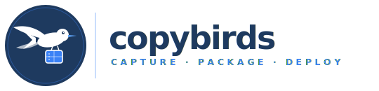

<p align="center">
  
</p>

<p align="center">
  <a href="LICENSE"></a>
  <a href="https://go.dev/"></a>
  
  
</p>

---

**Copybirds** traces every file a Linux program touches at runtime — shared libraries, config files, fonts, data — and packages them into a portable Docker image or self-extracting archive. Deploy any application to any Linux machine without manually hunting down missing dependencies.

## How it works

```
your program
     │
     ▼
  strace                    records every open/exec/access/connect syscall
     │
     ▼
cb trace                    parses strace log → structured XML manifest
     │
     ▼
cb meta                     enriches manifest with system metadata
     │                       (distro, installed packages, GL version)
     ├─ cb merge             (optional) merge traces from multiple runs
     │
     ▼
cb files                    copies all captured files into a staging directory
     │
     ├─ cb docker  ──────►  Docker image  (debian:bookworm-slim or alpine)
     └─ cb run    ──────►   self-extracting .sh archive  (interactive)
```

`cb run` runs the entire pipeline interactively in a single command.

---

## Installation

### Pre-built binary (recommended)

Download the latest release for your architecture from the [Releases](../../releases) page:

```bash
# Linux amd64
curl -L https://github.com/YOUR_ORG/copybirds/releases/latest/download/copybirds_linux_x86_64.tar.gz \
  | tar xz -C /usr/local/bin cb

# Linux arm64
curl -L https://github.com/YOUR_ORG/copybirds/releases/latest/download/copybirds_linux_arm64.tar.gz \
  | tar xz -C /usr/local/bin cb
```

Verify:

```bash
cb --version
```

### Build from source

Requirements: Go 1.22+

```bash
git clone https://github.com/YOUR_ORG/copybirds
cd copybirds
go build -o bin/cb ./cmd/cb
export PATH=$PATH:$(pwd)/bin
```

### Runtime dependency

`strace` must be installed on the source machine (the one you trace on):

```bash
# Debian / Ubuntu
sudo apt-get install strace

# Fedora / RHEL
sudo dnf install strace
```

`strace` is **not** required on the target machine where you deploy.

---

## Quick start

```bash
# Trace xclock and package it — guided, step by step
cb run xclock -digital
```

`cb run` will:
1. Run your program under `strace`
2. Parse the strace log into an XML manifest
3. Collect system metadata
4. Copy all dependencies to a staging directory
5. Ask whether you want a Docker image or a self-extracting archive

---

## Step-by-step usage

### 1. Trace your program

```bash
cb run MY_PROGRAM [ARGS...]
```

Or manually with strace:

```bash
strace -q -f -o strace.log \
  -e trace=open,openat,access,execve,clone,fork,vfork,chdir,readlink,getcwd,connect \
  MY_PROGRAM [ARGS...]
```

Run the program through all its important code paths so all dependencies are captured.

### 2. Convert the strace log to XML

Only needed for the manual workflow — `cb run` handles this automatically.

```bash
cb trace -s strace.log -o manifest.xml
```

### 3. Collect system metadata

```bash
cb meta manifest.xml
```

This adds distro info, installed `.deb` package states, and OpenGL version to the manifest. On a Debian/Ubuntu source system it also records which packages each file belongs to.

### 4. (Optional) Merge multiple traces

If the program has multiple code paths, trace each one separately and merge:

```bash
cb run MY_PROGRAM --mode A   # produces run_a.xml
cb run MY_PROGRAM --mode B   # produces run_b.xml

cb merge run_a.xml run_b.xml combined.xml
```

### 5. Copy files to a staging directory

```bash
cb files manifest.xml /tmp/staging/
```

All captured files are copied into `/tmp/staging/` preserving their original paths.

### 6. Package for deployment

**Docker image:**

```bash
cb docker /tmp/staging usr/bin/MY_PROGRAM

# Custom base image and tag
cb docker --base alpine --tag myapp:1.0 /tmp/staging usr/bin/MY_PROGRAM
```

The default base image is `debian:bookworm-slim`. Use `alpine` only when the program has no glibc dependency.

**Self-extracting archive** — produced automatically by `cb run`.

---

## Command reference

```
cb run      PROGRAM [ARGS...]   Trace and package a program (interactive)
cb trace    [FLAGS]             Convert strace output → XML manifest
cb meta     [FLAGS] XMLFILE     Collect or compare system metadata
cb merge    INPUT... OUTPUT     Merge multiple XML manifests
cb files    XMLFILE DESTDIR     Copy traced files to staging directory
cb docker   STAGING ENTRYPOINT Build Docker image from staging directory
cb deps     [PACKAGE...]        Analyze .deb package dependency chains
cb clean    XMLFILE             Remove all traced files from source system
```

```bash
cb --help           # full overview
cb COMMAND --help   # per-command help
cb completion bash  # generate shell completion
```

### Global verbosity flags

| Flag | Output |
|---|---|
| `-q` | Errors only |
| _(default)_ | Normal |
| `-v` | Verbose |
| `-vv` | Very verbose |
| `-vvv` | Debug |

```bash
cb -vv files manifest.xml /tmp/staging/
```

---

## Examples

```bash
# Trace a GUI application and package it
cb run firefox

# Manually trace, then build a Docker image
strace -q -f -o strace.log -e trace=open,openat,access,execve,connect myapp
cb trace -s strace.log -o manifest.xml
cb meta manifest.xml
cb files manifest.xml /tmp/myapp_staging/
cb docker --tag myapp:latest /tmp/myapp_staging usr/bin/myapp

# Merge traces from two runs and copy files
cb merge run1.xml run2.xml merged.xml
cb files merged.xml /tmp/staging/

# Verify dependencies on the target machine
cb meta --compare manifest.xml

# Analyze which .deb packages a library pulls in
cb deps libgtk-3-0 libpango-1.0-0

# Remove all traced files from the source system (cleanup)
cb clean manifest.xml
```

---

## Design

- **Linux only** — `strace` is Linux-specific; targets `linux/amd64` and `linux/arm64`
- **Static binary** — `CGO_ENABLED=0`, `cb` itself has no shared library dependencies
- **No external Go dependencies** — stdlib only
- **Debian-first** — package analysis uses `dpkg`/`apt`; other distros get file-level capture without package metadata

## License

Apache 2.0 — see [LICENSE](LICENSE)
